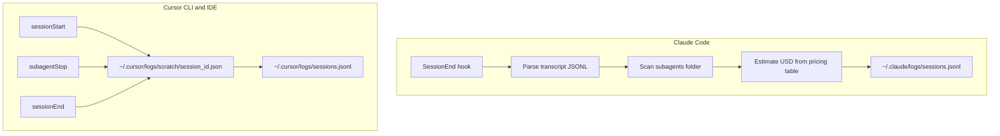

# Session cost logging

Per-session JSONL logs for debugging spend and agent routing across Claude Code
and Cursor (CLI + IDE).

## Log files

| Tool | Path |
|------|------|
| Claude Code | `~/.claude/logs/sessions.jsonl` |
| Cursor (CLI + IDE) | `~/.cursor/logs/sessions.jsonl` |

Scratch state for in-flight Cursor sessions lives in
`~/.cursor/logs/scratch/<session_id>.json` and is removed on `sessionEnd`.
Errors from the loggers (if any) append to `sessions.errors.log` next to the
JSONL file. Logs are runtime data under `~` — not committed to this repo.

## How it works



### Claude Code

[`home/.claude/settings.json`](home/.claude/settings.json) registers a
`SessionEnd` hook (`timeout: 15`) that runs
[`home/.claude/hooks/log-session.sh`](home/.claude/hooks/log-session.sh) →
[`log_session.py`](home/.claude/hooks/log_session.py).

Claude does **not** put USD on the hook payload. The logger:

1. Dedupes assistant usage by `requestId` (keep max `output_tokens` — one API
   call is split across multiple transcript lines).
2. Rolls in `…/<sessionId>/subagents/*.jsonl` (+ `*.meta.json` for `agentType`).
3. Estimates `cost_usd_estimate` from a local Opus / Sonnet / Haiku pricing
   table (incl. cache write/read). Labeled estimate — not billing truth.
4. Sets `success` from the exit `reason` (`other`, `clear`, `prompt_input_exit`,
   etc.).

Because `home/` is symlinked to `~`, Claude hooks apply as soon as this repo
is linked — no extra install step.

### Cursor (CLI + IDE)

[`home/.cursor/hooks.json`](home/.cursor/hooks.json) wires `sessionStart`,
`subagentStop`, and `sessionEnd` to
[`home/.cursor/hooks/log-session.sh`](home/.cursor/hooks/log-session.sh).

Cursor hooks expose duration / reason / subagent metadata but **not** token or
USD billing, so `usage` and `cost_usd_estimate` are `null`. Subagents are
accumulated in scratch during the session and flushed on end.

`~/.cursor` is **not** fully symlinked (Cursor owns chats, extensions, auth).
Managed paths are installed into the live tree by
[`home/agents/sync-agents`](home/agents/sync-agents):

| Repo | Live |
|------|------|
| `home/.cursor/hooks.json` | `~/.cursor/hooks.json` (symlink) |
| `home/.cursor/hooks/` | `~/.cursor/hooks/` (symlink) |
| `home/.cursor/cli-config.json` | `~/.cursor/cli-config.json` (prefs merged; auth/caches preserved) |

Re-run `./home/agents/sync-agents` after changing hooks or CLI prefs (also runs
from `machine_setup`).

## Record schema

Shared keys (missing fields are `null`):

```json
{
  "ts": "2026-07-17T18:00:00Z",
  "tool": "claude",
  "session_id": "…",
  "cwd": "/path/to/project",
  "success": true,
  "ended_reason": "other",
  "duration_ms": 12345,
  "models": ["claude-opus-4-8"],
  "subagents": [
    {
      "type": "scout",
      "description": "Locate auth middleware",
      "status": "completed",
      "duration_ms": 4000,
      "models": ["claude-haiku-4-5"]
    }
  ],
  "usage": {
    "input_tokens": 0,
    "output_tokens": 0,
    "cache_creation_input_tokens": 0,
    "cache_read_input_tokens": 0
  },
  "cost_usd_estimate": 1.23,
  "cost_estimate_incomplete": null,
  "transcript_path": "…"
}
```

Cursor rows add `final_status`, `error_message`, `is_background_agent`, and
`workspace_roots` when present.

## Quick queries

```bash
# Last 5 Claude sessions
tail -5 ~/.claude/logs/sessions.jsonl | jq .

# Estimated Claude spend today
jq -r 'select(.ts[:10] == (now | strftime("%Y-%m-%d"))) | .cost_usd_estimate // 0' \
  ~/.claude/logs/sessions.jsonl | awk '{s+=$1} END {printf "$%.4f\n", s}'

# Subagents used in recent Cursor sessions
tail -20 ~/.cursor/logs/sessions.jsonl | jq '{session_id, success, ended_reason, subagents: [.subagents[].type]}'
```

## Caveats

- Claude `cost_usd_estimate` tracks list API prices and can drift from Max/Team
  subscription economics or provider changes. Update the table in
  `home/.claude/hooks/log_session.py` when Anthropic revises rates.
- Unknown model IDs set `cost_estimate_incomplete: true` and omit that slice
  from the dollar total.
- Cursor cannot log USD/tokens until the product exposes them on hooks.
- Claude `SessionEnd` must finish within the configured timeout (15s here);
  very large transcripts may truncate parsing if the OS is extremely slow —
  raise `timeout` in `settings.json` if needed.
