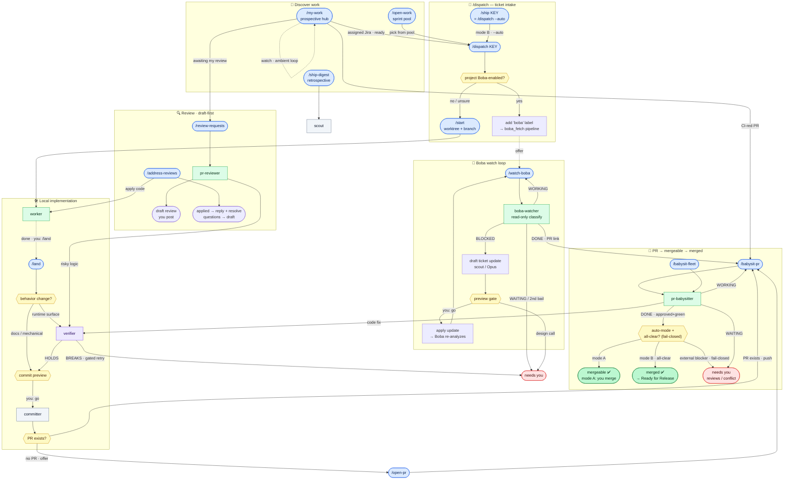

# Workflows

A visual map of the **commands** (authored in `home/commands/`, generated to
`home/.claude/commands/` and `home/.cursor/commands/`) and the **subagents**
(authored in `home/agents/`, generated to `home/.claude/agents/` and
`home/.cursor/agents/`) they orchestrate — roughly the PR lifecycle, front to
back. See [`CLAUDE.md`](home/.claude/CLAUDE.md) for the prose reference; shared
contracts live in [`home/protocols/`](home/protocols/).

## The flow graph

## Reading the graph

- **Rounded blue** nodes are slash **commands** you invoke; **rectangles** are
  **subagents** they spawn. **Hexagons** are decision / preview **gates**.
- Node colors encode the **subagent** model pin: 🟢 Sonnet, 🟣 Opus (`verifier`),
  ⚪ Haiku (`committer`, `scout`). Command **orchestrators** are pinned separately
  (cheap/mid via `tier:` in `home/commands/` — see
  [`home/commands/README.md`](home/commands/README.md)); none need strong/Opus.
  `scout` is the cheap Haiku LOCATE/gather retriever; its Sonnet sibling
  `scout-explain` (deep subsystem walkthroughs) isn't wired into the lifecycle
  flows, so it's listed in the table below rather than drawn here.
- The single **`verifier`** node is one agent invoked from several flows (the
  `/land` gate on local work, `pr-babysitter`, `pr-reviewer`) — the converging
  arrows show its reuse, not multiple agents.
- **`/land`** is the local counterpart to the Boba loop's `boba-watcher → /babysit-pr`
  hand-off: it closes the seam between `worker` and `/open-pr` by owning the
  post-`worker` conveyor (verifier gate → commit preview → `committer` → offer the
  next step). If a PR already exists it pushes the follow-up commit and offers
  `/babysit-pr` instead of `/open-pr`.
- **Red "needs you"** nodes are where a flow deliberately STOPS for a human: the
  design philosophy is *auto-fix the deterministic, surface the judgment calls*.
  The one carve-out: a review thread whose fix you actually applied and pushed
  gets an acknowledgement reply posted and the thread resolved
  (`/address-reviews`, and `/babysit-pr` on a picked nitpick) — scoped to work
  objectively completed. Anything needing your position stays a draft you post.
- Self-looping loops come in two **shapes**. **Shepherd** loops (`/watch-boba` →
  `boba-watcher`, `/babysit-pr` / `/babysit-fleet` → `pr-babysitter`) re-fire on a
  cache-warm interval via `ScheduleWakeup`, drive one target to a terminal state,
  and self-terminate on `DONE` / `WAITING` / `MERGED` via the shared `STATUS:`
  vocabulary. The **hub** loop (`/my-work watch`, the dashed self-edge on `MW`)
  borrows only the re-fire mechanism: it never converges, emits a per-tick
  `CHANGES` roll-up instead of `STATUS:`, runs on a slow idle-tick cadence, and
  stops on your action or an empty queue. Both shapes — the `STATUS:` enum, the two
  cadences, and the shape split — are defined once in
  [`home/protocols/LOOP-PROTOCOL.md`](home/protocols/LOOP-PROTOCOL.md).
- The `/dispatch → … → merged` **spine auto-chains** in one of two modes: **A**
  (default) auto-invokes each successor but pauses at every preview gate for a
  one-word `go`; **B** (via `/ship`, `--auto`, or the hubs' `ship <nums>`) runs
  through, auto-approving the deterministic (AUTO) gates and stopping only at
  judgment (STOP) gates. Every spine step ends with an `ADVANCE → <next>` or
  `HALT: <reason>` line the orchestrator dispatches on. The spine, the taxonomy,
  the conditional **auto-merge** (fail-closed, mode-B only — the `auto-mode +
  all-clear?` gate), and the **Jira lifecycle** (In Progress → In Review → Ready
  for Release) are defined once in
  [`home/protocols/HANDOFF-PROTOCOL.md`](home/protocols/HANDOFF-PROTOCOL.md) — the
  synchronous sibling of `LOOP-PROTOCOL.md`.
- **Notifications:** a `Notification` hook
  ([`home/.claude/hooks/notify.sh`](home/.claude/hooks/notify.sh)) pings macOS
  (desktop notification + chime) when a loop **needs you** — a preview gate,
  permission, or idle wait — so you can fire off a loop and walk away. OS-aware;
  falls back to `notify-send` / a terminal bell off macOS.

## Agents at a glance

| Agent | Model | Role | Driven by |
|---|---|---|---|
| `scout` | Haiku | read-only LOCATE / gather (excerpts, `file:line`, compact query results) | gather in `/my-work`, `/open-work`, `/ship-digest`; Boba unblock locate |
| `scout-explain` | Sonnet | read-only EXPLAIN — full-subsystem architecture/data-flow walkthrough | ad-hoc, when understanding (not locating) is the goal |
| `worker` | Sonnet | implementer for concrete, low-ambiguity specs | `/start`, `/address-reviews`, Boba unblock |
| `verifier` | Opus | adversarial correctness gate (tries to BREAK a change) | `/land` gate, `pr-babysitter`, `pr-reviewer` |
| `committer` | Haiku | git staging / commit-message / commit / push | `/land` (post-`worker` conveyor) |
| `pr-babysitter` | Sonnet | shepherd one PR toward mergeable (CI, rebase, body); conditional fail-closed auto-merge in auto-mode | `/babysit-pr`, `/babysit-fleet` |
| `pr-reviewer` | Sonnet | draft-only adversarial PR review (never posts) | `/review-requests` |
| `boba-watcher` | Sonnet (escalate→strong once on `ESCALATE`) | classify a Boba-dispatched ticket's latest signal | `/watch-boba` |
| `sweep` | Sonnet | mechanical fix loops (tsc / lint / formatting) | ad hoc (not bound to a command) |

> Opus / strong is reserved for reasoning-heavy work: the built-in `Plan` agent,
> `verifier`, hard debugging, and `/watch-boba`'s mid→strong carve-outs
> (ambiguous re-classify; scope/approach unblock drafts).
