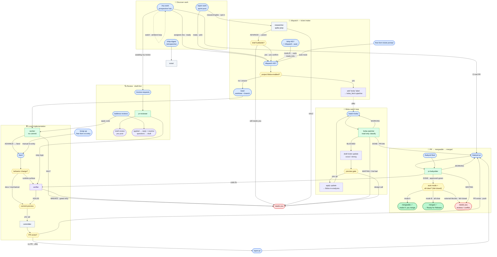
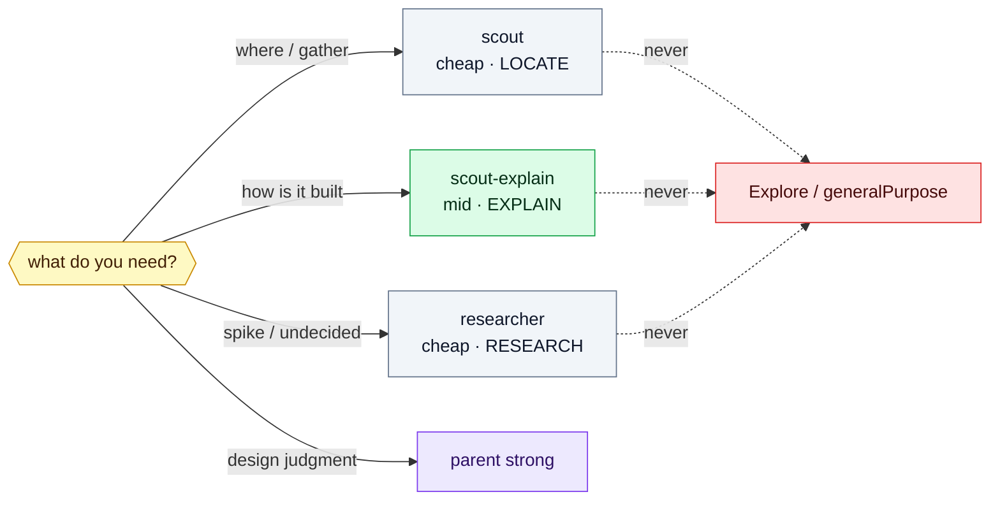

# Workflows

> Domain glossary: [`CONTEXT.md`](CONTEXT.md). Host routing prose:
> [`home/.claude/CLAUDE.md`](home/.claude/CLAUDE.md). Hard must-nots:
> **agent-routing** (generated into `~/.cursor/rules/agent-routing.mdc` +
> `CLAUDE.md`). Whom-table: [`home/skills/route-agents/`](home/skills/route-agents/).
> Shell/herdr/Neovim CLI launchers (Claude vs Cursor by cwd): [`ALIASES.md`](ALIASES.md),
> [`KEYBINDS.md`](KEYBINDS.md), [`CLAUDE.md`](CLAUDE.md#coding-agent-routing-claude-vs-cursor).

A visual map of the **commands** (authored in `home/commands/`, generated to
`home/.claude/commands/` and `home/.cursor/commands/`) and the **subagents**
(authored in `home/agents/`, generated to `home/.claude/agents/` and
`home/.cursor/agents/`) they orchestrate — roughly the PR lifecycle, front to
back. Shared contracts live in [`home/protocols/`](home/protocols/).

## The flow graph

```mermaid
flowchart TD
    %% ---------- node groups (declared first for clean subgraph membership) ----------
    subgraph disc["🧭 Discover work"]
        direction LR
        MW(["/my-work<br/>prospective hub"])
        OW(["/open-work<br/>sprint pool"])
        SD(["/ship-digest<br/>retrospective"])
    end

    subgraph dispatch["🔀 /dispatch — ticket intake"]
        SHIP(["/ship KEY<br/>= /dispatch --auto"])
        DSP(["/dispatch KEY"])
        DISP{{"project Boba-enabled?"}}
        LBL["add 'boba' label<br/>→ boba_fetch pipeline"]
        ST(["/start<br/>worktree + branch"])
        RSH["researcher<br/>spike prep"]
        PREP{{"brief buildable?"}}
    end

    subgraph boba["🫧 Boba watch loop"]
        WB(["/watch-boba"])
        BW["boba-watcher<br/>read-only classify"]
        UNB["draft ticket update<br/>scout / strong"]
        PG{{"preview gate"}}
        APP["apply update<br/>→ Boba re-analyzes"]
    end

    subgraph impl["🛠 Local implementation"]
        WK["worker<br/>no commit"]
        LND(["/land"])
        VG{{"behavior change?"}}
        VER["verifier"]
        LPG{{"commit preview"}}
        CM["committer"]
        PRQ{{"PR exists?"}}
    end

    subgraph pr["🚦 PR → mergeable → merged"]
        BP(["/babysit-pr"])
        FL(["/babysit-fleet"])
        PRB["pr-babysitter"]
        AM{{"auto-mode +<br/>all-clear? (fail-closed)"}}
        MERGE(["mergeable ✅<br/>mode A: you merge"])
        MRG(["merged ✅<br/>→ Ready for Release"])
        HUM2(["needs you<br/>reviews / conflict"])
    end

    subgraph rev["🔍 Review · draft-first"]
        RR(["/review-requests"])
        PRR["pr-reviewer"]
        DR(["draft review<br/>you post"])
        AR(["/address-reviews"])
        DRP(["applied → reply + resolve<br/>questions → draft"])
    end

    SCOUT["scout"]
    OP(["/open-pr"])
    WU(["/wrap-up<br/>free-form re-entry"])
    FF(["free-form ticket prompt"])
    HUM1(["needs you"])

    %% ---------- edges ----------
    MW -->|"assigned Jira · ready"| DSP
    MW -->|"CI-red PR"| BP
    MW -->|"awaiting my review"| RR
    MW -.->|"watch · ambient loop"| MW
    OW -->|"ready · pick"| DSP
    OW -->|"research/spike · opt-in"| RSH
    RSH -->|"ADVANCE → parent"| PREP
    PREP -->|"yes · you confirm"| DSP
    PREP -->|"still needs you"| HUM1
    RSH -->|"HALT"| HUM1
    SD --> SCOUT

    SHIP -->|"mode B · --auto<br/>ready only"| DSP
    FF -->|auto-route| DSP
    DSP --> DISP
    DISP -->|"yes"| LBL
    DISP -->|"no / unsure"| ST
    LBL -. "offer" .-> WB
    ST --> WK

    WB --> BW
    BW -->|"WORKING"| WB
    BW -->|"BLOCKED"| UNB
    UNB --> PG
    PG -->|"you: go"| APP
    APP --> WB
    BW -->|"DONE · PR link"| BP
    BW -->|"WAITING / 2nd bail"| HUM1
    PG -->|"design call"| HUM1

    WK -->|"ADVANCE → /land"| LND
    WU -->|"manual re-entry"| LND
    WK -->|"HALT"| HUM1
    LND --> VG
    VG -->|"runtime surface"| VER
    VG -->|"docs / mechanical"| LPG
    VER -->|"HOLDS"| LPG
    VER -->|"BREAKS · gated retry"| HUM1
    LPG -->|"you: go"| CM
    CM --> PRQ
    PRQ -->|"no PR · offer"| OP
    PRQ -->|"PR exists · push"| BP
    OP --> BP

    BP --> PRB
    FL --> PRB
    PRB -->|"code fix"| VER
    PRB -->|"WORKING"| BP
    PRB -->|"DONE · approved+green"| AM
    AM -->|"mode B · all-clear"| MRG
    AM -->|"mode A"| MERGE
    AM -->|"external blocker · fail-closed"| HUM2
    PRB -->|"WAITING"| HUM2

    RR --> PRR
    PRR -->|"risky logic"| VER
    PRR --> DR
    AR -->|"apply code"| WK
    AR --> DRP

    %% ---------- styling (tier colors, not host model names) ----------
    classDef command fill:#dbeafe,stroke:#2563eb,color:#0b2559;
    classDef mid     fill:#dcfce7,stroke:#16a34a,color:#052e16;
    classDef strong  fill:#ede9fe,stroke:#7c3aed,color:#2e1065;
    classDef cheap   fill:#f1f5f9,stroke:#64748b,color:#0f172a;
    classDef gate    fill:#fef9c3,stroke:#ca8a04,color:#422006;
    classDef human   fill:#fee2e2,stroke:#dc2626,color:#450a0a;
    classDef done    fill:#bbf7d0,stroke:#15803d,color:#052e16;

    class MW,OW,SD,WB,DSP,ST,OP,BP,FL,RR,AR,LND,SHIP,WU,FF command;
    class BW,WK,PRB,PRR mid;
    class VER strong;
    class CM,SCOUT,RSH cheap;
    class DISP,PG,VG,LPG,PRQ,AM,PREP gate;
    class HUM1,HUM2 human;
    class MERGE,MRG done;
```

## Read agents (locate · explain · research)

Glossary: [`CONTEXT.md`](CONTEXT.md) (Read agents). Seam at a glance (never
Explore / `generalPurpose`):

```mermaid
flowchart LR
    NEED{{"what do you need?"}}
    NEED -->|"where / gather"| SCOUT["scout<br/>cheap · LOCATE"]
    NEED -->|"how is it built"| SEX["scout-explain<br/>mid · EXPLAIN"]
    NEED -->|"spike / undecided"| RSH["researcher<br/>cheap · RESEARCH"]
    NEED -->|"design judgment"| PAR["parent strong"]
    SCOUT -.->|"never"| BAD["Explore / generalPurpose"]
    SEX -.->|"never"| BAD
    RSH -.->|"never"| BAD
    classDef cheap fill:#f1f5f9,stroke:#64748b,color:#0f172a;
    classDef mid fill:#dcfce7,stroke:#16a34a,color:#052e16;
    classDef strong fill:#ede9fe,stroke:#7c3aed,color:#2e1065;
    classDef gate fill:#fef9c3,stroke:#ca8a04,color:#422006;
    classDef bad fill:#fee2e2,stroke:#dc2626,color:#450a0a;
    class SCOUT,RSH cheap;
    class SEX mid;
    class PAR strong;
    class NEED gate;
    class BAD bad;
```

## Reading the graph

- **Rounded blue** nodes are slash **commands** you invoke; **rectangles** are
  **subagents** they spawn. **Hexagons** are decision / preview **gates**.
- Node colors encode the **subagent tier**: 🟢 mid, 🟣 strong (`verifier`),
  ⚪ cheap (`committer`, `scout`, `researcher`). Command **orchestrators** are pinned separately
  (cheap/mid via `tier:` in `home/commands/` — see
  [`home/commands/README.md`](home/commands/README.md)); none need strong.
- **`researcher`** sits *above* `/dispatch` on the graph (opt-in prep; contract
  in [`HANDOFF-PROTOCOL.md`](home/protocols/HANDOFF-PROTOCOL.md)).
- **`scout-explain`** and **`sweep`** are real agents (see table) but mostly
  ad-hoc — not drawn on the spine.
- The single **`verifier`** node is one agent invoked from several flows (the
  `/land` gate on local work, `pr-babysitter`, `pr-reviewer`) — the converging
  arrows show its reuse, not multiple agents.
- **`/land`** closes the seam between `worker` and `/open-pr` (verifier → commit
  preview → `committer`). If a PR already exists it offers `/babysit-pr` instead
  of `/open-pr`. Commit rules: **agent-routing** (worker/parent never `git commit`).
- **Red "needs you"** nodes are where a flow deliberately STOPS for a human: the
  design philosophy is *auto-fix the deterministic, surface the judgment calls*.
  The one carve-out: a review thread whose fix you actually applied and pushed
  gets an acknowledgement reply posted and the thread resolved
  (`/address-reviews`, and `/babysit-pr` on a picked nitpick) — scoped to work
  objectively completed. Anything needing your position stays a draft you post.
- Self-looping loops come in two **shapes**. **Shepherd** loops (`/watch-boba` →
  `boba-watcher`, `/babysit-pr` / `/babysit-fleet` → `pr-babysitter`) re-fire on a
  cache-warm interval via `ScheduleWakeup`, drive one target to a terminal state,
  and self-terminate on `DONE` / `WAITING` / `MERGED` via the shared `STATUS:`
  vocabulary. The **hub** loop (`/my-work watch`, the dashed self-edge on `MW`)
  borrows only the re-fire mechanism: it never converges, emits a per-tick
  `CHANGES` roll-up instead of `STATUS:`, runs on a slow idle-tick cadence, and
  stops on your action or an empty queue. Both shapes — the `STATUS:` enum, the two
  cadences, and the shape split — are defined once in
  [`home/protocols/LOOP-PROTOCOL.md`](home/protocols/LOOP-PROTOCOL.md).
- The `/dispatch → … → merged` **spine auto-chains** in one of two modes: **A**
  (default) auto-invokes each successor but pauses at every preview gate for a
  one-word `go`; **B** (via `/ship`, `--auto`, or the hubs' `ship <nums>`) runs
  through, auto-approving the deterministic (AUTO) gates and stopping only at
  judgment (STOP) gates. Every spine step ends with an `ADVANCE → <next>` or
  `HALT: <reason>` line the orchestrator dispatches on — missing line ⇒
  `HALT: missing terminal contract`. The spine, the taxonomy, the conditional
  **auto-merge** (fail-closed, mode-B only — the `auto-mode + all-clear?` gate),
  and the **Jira lifecycle** (In Progress → In Review → Ready for Release) are
  defined once in
  [`home/protocols/HANDOFF-PROTOCOL.md`](home/protocols/HANDOFF-PROTOCOL.md) — the
  synchronous sibling of `LOOP-PROTOCOL.md`.
- **Notifications:** Claude Code (`preferredNotifChannel: auto`) and Cursor CLI
  (`notifications: true`) send native desktop notifications when a session
  **needs you** — idle wait or permission — so you can fire off a loop and walk
  away. Relies on the terminal (Ghostty / Kitty / iTerm2) + OS notification
  permission.

## Free-form prompts and async triage

- **Free-form ticket prompts** (e.g. "investigate ECW-1231" or a Jira URL) are
  routed to the spine by the parent, not executed directly. The parent extracts
  the key and calls `/dispatch <KEY>` (mode A) or `/ship <KEY>` (mode B).
- **`/wrap-up`** is the manual re-entry point for work done outside the spine.
  It forwards to `/land` and auto-advances to `/open-pr`, so the user does not
  need to invoke two commands to finish.
- **Security-review findings** pushed after the PR belong to the async tail:
  route them to `/babysit-pr` or a security inbox, not back into the parent
  session, unless they touch code this work changed.

## Agents at a glance

| Agent | Model | Role | Driven by |
|---|---|---|---|
| `scout` | Haiku | read-only LOCATE / gather (excerpts, `file:line`, compact query results) | gather in `/my-work`, `/open-work`, `/ship-digest`; Boba unblock locate |
| `scout-explain` | Sonnet | read-only EXPLAIN — full-subsystem architecture/data-flow walkthrough | ad-hoc; architecture-review skills; never Explore |
| `researcher` | Haiku | read-only RESEARCH / spike prep (hypotheses, open questions); `ADVANCE → parent` | `/open-work` opt-in before `/dispatch` on research/spike tickets |
| `worker` | Sonnet | implementer for concrete, low-ambiguity specs; **never commits**; `ADVANCE → /land` | `/start`, `/address-reviews`, Boba unblock |
| `verifier` | Opus | adversarial correctness gate (tries to BREAK a change); `VERDICT:` | `/land` gate, `pr-babysitter`, `pr-reviewer` |
| `committer` | Haiku | git staging / commit-message / commit / push | `/land` (post-`worker` conveyor); docs-only commits from parent |
| `pr-babysitter` | Sonnet | shepherd one PR toward mergeable (CI, rebase, body); conditional fail-closed auto-merge in auto-mode | `/babysit-pr`, `/babysit-fleet` |
| `pr-reviewer` | Sonnet | draft-only adversarial PR review (never posts) | `/review-requests` |
| `boba-watcher` | Haiku (escalate→strong once on `ESCALATE`) | classify a Boba-dispatched ticket's latest signal | `/watch-boba` |
| `sweep` | Sonnet | mechanical fix loops (tsc / lint / formatting); `ADVANCE → /land` or `done` | ad hoc (not bound to a command) |

> Opus / strong is reserved for reasoning-heavy work: the built-in `Plan` agent,
> `verifier`, hard debugging, architecture critique, and `/watch-boba`'s
> cheap→strong carve-outs (ambiguous re-classify; scope/approach unblock drafts).
> Never use Explore / generalPurpose for locate — that burns strong-tier cost.
