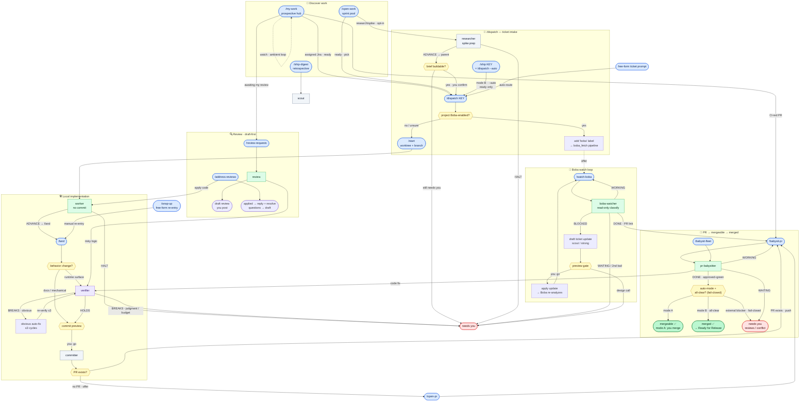
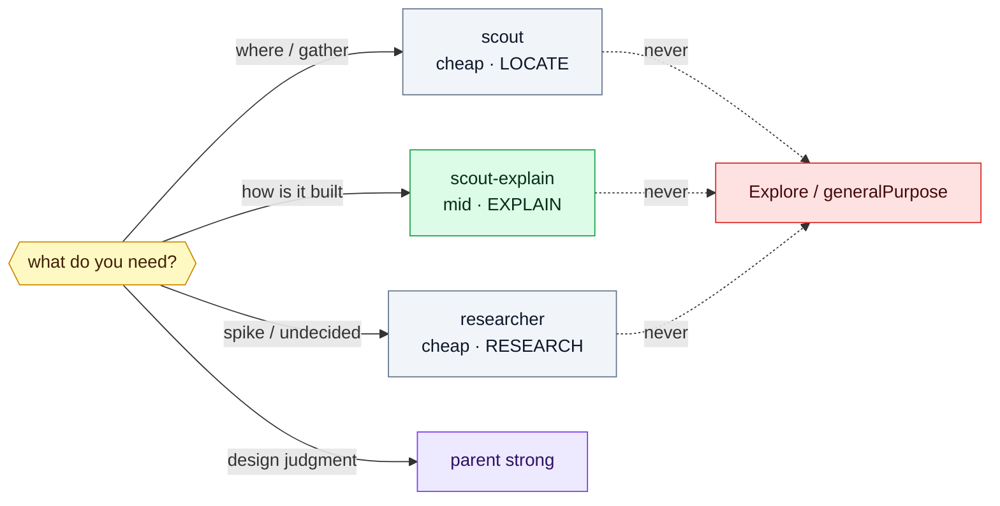
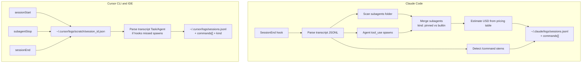

# Workflows

> Domain glossary: [`CONTEXT.md`](CONTEXT.md). Host routing prose:
> [`home/.claude/CLAUDE.md`](home/.claude/CLAUDE.md). Hard must-nots:
> **agent-routing** (generated into `~/.cursor/rules/agent-routing.mdc` +
> `CLAUDE.md`). Whom-table: [`home/skills/route-agents/`](home/skills/route-agents/).
> Shell/herdr/Neovim CLI launchers (Claude work / Codex personal; Cursor via override): [`ALIASES.md`](ALIASES.md),
> [`KEYBINDS.md`](KEYBINDS.md), [`CLAUDE.md`](CLAUDE.md#coding-agent-routing).

A visual map of the **commands** (authored in `home/commands/`, generated to
`home/.claude/commands/` and `home/.cursor/commands/`) and the **subagents**
(authored in `home/agents/`, generated to `home/.codex/agents/`,
`home/.claude/agents/`, `home/.cursor/agents/`, and `home/.agents/agents/`) they orchestrate — roughly the PR lifecycle, front to
back. Shared contracts live in [`home/protocols/`](home/protocols/).

## The flow graph


```mermaid
flowchart TD
    %% ---------- node groups (declared first for clean subgraph membership) ----------
    subgraph disc["🧭 Discover work"]
        direction LR
        MW(["/my-work<br/>prospective hub"])
        OW(["/open-work<br/>sprint pool"])
        SD(["/ship-digest<br/>retrospective"])
    end

    subgraph dispatch["🔀 /dispatch — ticket intake"]
        SHIP(["/ship KEY<br/>= /dispatch --auto"])
        DSP(["/dispatch KEY"])
        DISP{{"project Boba-enabled?"}}
        LBL["add 'boba' label<br/>→ boba_fetch pipeline"]
        ST(["/start<br/>worktree + branch"])
        RSH["researcher<br/>spike prep"]
        PREP{{"brief buildable?"}}
    end

    subgraph boba["🫧 Boba watch loop"]
        WB(["/watch-boba"])
        BW["boba-watcher<br/>read-only classify"]
        UNB["draft ticket update<br/>scout / strong"]
        PG{{"preview gate"}}
        APP["apply update<br/>→ Boba re-analyzes"]
    end

    subgraph impl["🛠 Local implementation"]
        WK["worker<br/>no commit"]
        LND(["/land"])
        VG{{"behavior change?"}}
        VER["verifier"]
        FIX["obvious auto-fix<br/>≤3 cycles"]
        LPG{{"commit preview"}}
        CM["committer"]
        PRQ{{"PR exists?"}}
    end

    subgraph pr["🚦 PR → mergeable → merged"]
        BP(["/babysit-pr"])
        FL(["/babysit-fleet"])
        PRB["pr-babysitter"]
        AM{{"auto-mode +<br/>all-clear? (fail-closed)"}}
        MERGE(["mergeable ✅<br/>mode A: you merge"])
        MRG(["merged ✅<br/>→ Ready for Release"])
        HUM2(["needs you<br/>reviews / conflict"])
    end

    subgraph rev["🔍 Review · draft-first"]
        RR(["/review-requests"])
        PRR["review"]
        DR(["draft review<br/>you post"])
        AR(["/address-reviews"])
        DRP(["applied → reply + resolve<br/>questions → draft"])
    end

    SCOUT["scout"]
    OP(["/open-pr"])
    WU(["/wrap-up<br/>free-form re-entry"])
    FF(["free-form ticket prompt"])
    HUM1(["needs you"])

    %% ---------- edges ----------
    MW -->|"assigned Jira · ready"| DSP
    MW -->|"CI-red PR"| BP
    MW -->|"awaiting my review"| RR
    MW -.->|"watch · ambient loop"| MW
    OW -->|"ready · pick"| DSP
    OW -->|"research/spike · opt-in"| RSH
    RSH -->|"ADVANCE → parent"| PREP
    PREP -->|"yes · you confirm"| DSP
    PREP -->|"still needs you"| HUM1
    RSH -->|"HALT"| HUM1
    SD --> SCOUT

    SHIP -->|"mode B · --auto<br/>ready only"| DSP
    FF -->|auto-route| DSP
    DSP --> DISP
    DISP -->|"yes"| LBL
    DISP -->|"no / unsure"| ST
    LBL -. "offer" .-> WB
    ST --> WK

    WB --> BW
    BW -->|"WORKING"| WB
    BW -->|"BLOCKED"| UNB
    UNB --> PG
    PG -->|"you: go"| APP
    APP --> WB
    BW -->|"DONE · PR link"| BP
    BW -->|"WAITING / 2nd bail"| HUM1
    PG -->|"design call"| HUM1

    WK -->|"ADVANCE → /land"| LND
    WU -->|"manual re-entry"| LND
    WK -->|"HALT"| HUM1
    LND --> VG
    VG -->|"runtime surface"| VER
    VG -->|"docs / mechanical"| LPG
    VER -->|"HOLDS"| LPG
    VER -->|"BREAKS · obvious"| FIX
    FIX -->|"re-verify ≤3"| VER
    VER -->|"BREAKS · judgment / budget"| HUM1
    LPG -->|"you: go"| CM
    CM --> PRQ
    PRQ -->|"no PR · offer"| OP
    PRQ -->|"PR exists · push"| BP
    OP --> BP

    BP --> PRB
    FL --> PRB
    PRB -->|"code fix"| VER
    PRB -->|"WORKING"| BP
    PRB -->|"DONE · approved+green"| AM
    AM -->|"mode B · all-clear"| MRG
    AM -->|"mode A"| MERGE
    AM -->|"external blocker · fail-closed"| HUM2
    PRB -->|"WAITING"| HUM2

    RR --> PRR
    PRR -->|"risky logic"| VER
    PRR --> DR
    AR -->|"apply code"| WK
    AR --> DRP

    %% ---------- styling (tier colors, not host model names) ----------
    classDef command fill:#dbeafe,stroke:#2563eb,color:#0b2559;
    classDef mid     fill:#dcfce7,stroke:#16a34a,color:#052e16;
    classDef strong  fill:#ede9fe,stroke:#7c3aed,color:#2e1065;
    classDef cheap   fill:#f1f5f9,stroke:#64748b,color:#0f172a;
    classDef gate    fill:#fef9c3,stroke:#ca8a04,color:#422006;
    classDef human   fill:#fee2e2,stroke:#dc2626,color:#450a0a;
    classDef done    fill:#bbf7d0,stroke:#15803d,color:#052e16;

    class MW,OW,SD,WB,DSP,ST,OP,BP,FL,RR,AR,LND,SHIP,WU,FF command;
    class BW,WK,PRB,PRR mid;
    class VER strong;
    class CM,SCOUT,RSH cheap;
    class DISP,PG,VG,LPG,PRQ,AM,PREP gate;
    class HUM1,HUM2 human;
    class MERGE,MRG done;
```

## Read agents (locate · explain · research)

Glossary: [`CONTEXT.md`](CONTEXT.md) (Read agents). Seam at a glance (never
Explore / `generalPurpose`):


```mermaid
flowchart LR
    NEED{{"what do you need?"}}
    NEED -->|"where / gather"| SCOUT["scout<br/>cheap · LOCATE"]
    NEED -->|"how is it built"| SEX["scout-explain<br/>mid · EXPLAIN"]
    NEED -->|"spike / undecided"| RSH["researcher<br/>cheap · RESEARCH"]
    NEED -->|"design judgment"| PAR["parent strong"]
    SCOUT -.->|"never"| BAD["Explore / generalPurpose"]
    SEX -.->|"never"| BAD
    RSH -.->|"never"| BAD
    classDef cheap fill:#f1f5f9,stroke:#64748b,color:#0f172a;
    classDef mid fill:#dcfce7,stroke:#16a34a,color:#052e16;
    classDef strong fill:#ede9fe,stroke:#7c3aed,color:#2e1065;
    classDef gate fill:#fef9c3,stroke:#ca8a04,color:#422006;
    classDef bad fill:#fee2e2,stroke:#dc2626,color:#450a0a;
    class SCOUT,RSH cheap;
    class SEX mid;
    class PAR strong;
    class NEED gate;
    class BAD bad;
```

## Reading the graph

- **Rounded blue** nodes are slash **commands** you invoke; **rectangles** are
  **subagents** they spawn. **Hexagons** are decision / preview **gates**.
- Node colors encode the **subagent tier**: 🟢 mid, 🟣 strong (`verifier`),
  ⚪ cheap (`committer`, `scout`, `researcher`). Command **orchestrators** are pinned separately
  (cheap/mid via `tier:` in `home/commands/` — see
  [`home/commands/README.md`](home/commands/README.md)); none need strong.
- **`researcher`** sits *above* `/dispatch` on the graph (opt-in prep; contract
  in [`HANDOFF-PROTOCOL.md`](home/protocols/HANDOFF-PROTOCOL.md)).
- **`scout-explain`** and **`sweep`** are real agents (see table) but mostly
  ad-hoc — not drawn on the spine.
- The single **`verifier`** node is one agent invoked from several flows (the
  `/land` gate on local work, `pr-babysitter`) — the converging
  arrows show its reuse, not multiple agents.
- **`/land`** closes the seam between `worker` and `/open-pr` (verifier → commit
  preview → `committer`). Obvious `verifier` BREAKS auto-repair and re-verify
  (≤3 cycles); judgment / budget-exhausted BREAKS still STOP. If a PR already
  exists it offers `/babysit-pr` instead of `/open-pr`. Commit rules:
  **agent-routing** (worker/parent never `git commit`).
- **Red "needs you"** nodes are where a flow deliberately STOPS for a human: the
  design philosophy is *auto-fix the deterministic, surface the judgment calls*.
  The one carve-out: a review thread whose fix you actually applied and pushed
  gets an acknowledgement reply posted and the thread resolved
  (`/address-reviews`, and `/babysit-pr` on a picked nitpick) — scoped to work
  objectively completed. Anything needing your position stays a draft you post.
- Self-looping loops come in two **shapes**. **Shepherd** loops (`/watch-boba` →
  `boba-watcher`, `/babysit-pr` / `/babysit-fleet` → `pr-babysitter`) re-fire via
  `ScheduleWakeup` at a cadence paced by the target, drive one target to a terminal state,
  and self-terminate on `DONE` / `WAITING` / `MERGED` via the shared `STATUS:`
  vocabulary. The **hub** loop (`/my-work watch`, the dashed self-edge on `MW`)
  borrows only the re-fire mechanism: it never converges, emits a per-tick
  `CHANGES` roll-up instead of `STATUS:`, runs on a slow idle-tick cadence, and
  stops on your action or an empty queue. Both shapes — the `STATUS:` enum, the two
  cadences, and the shape split — are defined once in
  [`home/protocols/LOOP-PROTOCOL.md`](home/protocols/LOOP-PROTOCOL.md).
- The `/dispatch → … → merged` **spine auto-chains** in one of two modes: **A**
  (default) auto-invokes each successor but pauses at every preview gate for a
  one-word `go`; **B** (via `/ship`, `--auto`, or the hubs' `ship <nums>`) runs
  through, auto-approving the deterministic (AUTO) gates and stopping only at
  judgment (STOP) gates. Every spine step ends with an `ADVANCE → <next>` or
  `HALT: <reason>` line the orchestrator dispatches on — missing line ⇒
  `HALT: missing terminal contract`. The spine, the taxonomy, the conditional
  **auto-merge** (fail-closed, mode-B only — the `auto-mode + all-clear?` gate),
  and the **Jira lifecycle** (In Progress → In Review → Ready for Release) are
  defined once in
  [`home/protocols/HANDOFF-PROTOCOL.md`](home/protocols/HANDOFF-PROTOCOL.md) — the
  synchronous sibling of `LOOP-PROTOCOL.md`.
- **Notifications:** Claude Code (`preferredNotifChannel: auto`) and Cursor CLI
  (`notifications: true`) send native desktop notifications when a session
  **needs you** — idle wait or permission — so you can fire off a loop and walk
  away. Relies on the terminal (Ghostty / Kitty / iTerm2) + OS notification
  permission.

## Free-form prompts and async triage

- **Free-form ticket prompts** (e.g. "investigate ECW-1231" or a Jira URL) are
  routed to the spine by the parent, not executed directly. The parent extracts
  the key and calls `/dispatch <KEY>` (mode A) or `/ship <KEY>` (mode B).
- **`/wrap-up`** is the manual re-entry point for work done outside the spine.
  It forwards to `/land` and auto-advances to `/open-pr`, so the user does not
  need to invoke two commands to finish.
- **Security-review findings** pushed after the PR belong to the async tail:
  route them to `/triage-security` (or `/babysit-pr` when already classified),
  not back into the parent session, unless they touch code this work changed.

## Agents at a glance

Pins come from `home/agents/` + `model-map.yaml` (emitted by **sync**). Roles and
who drives each agent live in the agent sources and the flow graph above — do not
hand-edit the roster table.

<!-- BEGIN GENERATED WORKFLOWS AGENT ROSTER -->
| Agent | Tier | Claude | Cursor | Agy | Codex (effort) |
| --- | --- | --- | --- | --- | --- |
| `boba-watcher` | cheap | `haiku` | `composer-2.5` | `flash_lite` | `gpt-6-luna` (medium) |
| `committer` | cheap | `haiku` | `composer-2.5` | `flash_lite` | `gpt-6-luna` (medium) |
| `researcher` | cheap | `haiku` | `composer-2.5` | `flash_lite` | `gpt-6-luna` (medium) |
| `scout` | cheap | `haiku` | `composer-2.5` | `flash_lite` | `gpt-6-luna` (medium) |
| `security-triage` | cheap | `haiku` | `composer-2.5` | `flash_lite` | `gpt-6-luna` (medium) |
| `pr-babysitter` | mid | `claude-sonnet-5-5` | `composer-2.5-fast` | `flash` | `gpt-6.1-sol` (medium) |
| `scout-explain` | mid | `claude-sonnet-5-5` | `composer-2.5-fast` | `flash` | `gpt-6.1-sol` (medium) |
| `sweep` | mid | `claude-sonnet-5-5` | `composer-2.5-fast` | `flash` | `gpt-6.1-sol` (medium) |
| `worker` | mid | `claude-sonnet-5-5` | `composer-2.5-fast` | `flash` | `gpt-6.1-sol` (medium) |
| `planner` | strong | `claude-opus-5-5` | `cursor-grok-4.6-high-fast` | `pro` | `gpt-6-astra` (high) |
| `review` | strong | `claude-opus-5-5` | `cursor-grok-4.6-high-fast` | `pro` | `gpt-6-astra` (high) |
| `verifier` | strong | `claude-opus-5-5` | `cursor-grok-4.6-high-fast` | `pro` | `gpt-6-astra` (high) |
<!-- END GENERATED WORKFLOWS AGENT ROSTER -->

> Opus / strong is reserved for reasoning-heavy work: `planner`,
> `verifier`, hard debugging, architecture critique, and `/watch-boba`'s
> cheap→strong carve-outs (ambiguous re-classify; scope/approach unblock drafts).
> Never use Explore / generalPurpose for locate — that burns strong-tier cost.

## Telemetry / session cost

Per-session JSONL logs for debugging spend and agent routing across Claude Code
and Cursor (CLI + IDE).

## Log files

| Tool | Path |
|------|------|
| Claude Code | `~/.claude/logs/sessions.jsonl` |
| Cursor (CLI + IDE) | `~/.cursor/logs/sessions.jsonl` |
| Antigravity (`agy`) | `~/.gemini/logs/sessions.jsonl` |

Scratch state for in-flight Cursor sessions lives in
`~/.cursor/logs/scratch/<session_id>.json` and is removed on `sessionEnd`.
Errors from the loggers (if any) append to `sessions.errors.log` next to the
JSONL file. Logs are runtime data under `~` — not committed to this repo.

## How it works


```mermaid
flowchart TB
  subgraph claudePath [Claude Code]
    CEnd[SessionEnd hook] --> CParse[Parse transcript JSONL]
    CParse --> CSub[Scan subagents folder]
    CParse --> CAgent[Agent tool_use spawns]
    CParse --> CCmd[Detect /command stems]
    CSub --> CMerge[Merge subagents<br/>kind: pinned vs builtin]
    CAgent --> CMerge
    CMerge --> CEst[Estimate USD from pricing table]
    CEst --> CLog["~/.claude/logs/sessions.jsonl<br/>+ commands[]"]
    CCmd --> CLog
  end

  subgraph cursorPath [Cursor CLI and IDE]
    SStart[sessionStart] --> Scratch["~/.cursor/logs/scratch/session_id.json"]
    SStop[subagentStop] --> Scratch
    SEnd[sessionEnd] --> Scratch
    Scratch --> TParse[Parse transcript Task/Agent<br/>if hooks missed spawns]
    TParse --> CFlush["~/.cursor/logs/sessions.jsonl<br/>+ commands[] + kind"]
  end
```

### Claude Code

[`home/.claude/settings.json`](home/.claude/settings.json) registers a
`SessionEnd` hook (`timeout: 15`) that runs
[`home/.claude/hooks/log-session.sh`](home/.claude/hooks/log-session.sh) →
[`log_session.py`](home/.claude/hooks/log_session.py).

Claude does **not** put USD on the hook payload. The logger:

1. Dedupes assistant usage by `requestId` (keep max `output_tokens` — one API
   call is split across multiple transcript lines).
2. Rolls in `…/<sessionId>/subagents/*.jsonl` (+ `*.meta.json` for `agentType`).
3. Merges `Agent` tool_use spawns from the parent transcript when the folder is
   missing/incomplete; tags each with `kind: pinned|builtin` and `source`.
4. Detects slash-command stems (`/land`, `/dispatch`, …) into `commands[]`.
5. Estimates `cost_usd_estimate` from a local Opus / Sonnet / Haiku pricing
   table (incl. cache write/read). Labeled estimate — not billing truth.
6. Sets `success` from the exit `reason` (`other`, `clear`, `prompt_input_exit`,
   etc.).

Because `home/` is symlinked to `~`, Claude hooks apply as soon as this repo
is linked — no extra install step.

### Cursor (CLI + IDE)

[`home/.cursor/hooks.json`](home/.cursor/hooks.json) wires `sessionStart`,
`subagentStop`, and `sessionEnd` to
[`home/.cursor/hooks/log-session.sh`](home/.cursor/hooks/log-session.sh).

Cursor hooks expose duration / reason / subagent metadata but **not** token or
USD billing, so `usage` and `cost_usd_estimate` are `null`. Subagents are
accumulated in scratch during the session and flushed on end.

`~/.cursor` is **not** fully symlinked (Cursor owns chats, extensions, auth).
Managed paths are installed into the live tree by **sync**
([`home/sync/sync`](home/sync/sync)):

| Repo | Live |
|------|------|
| `home/.cursor/hooks.json` | `~/.cursor/hooks.json` (symlink) |
| `home/.cursor/hooks/` | `~/.cursor/hooks/` (symlink) |
| `home/.cursor/cli-config.json` | `~/.cursor/cli-config.json` (prefs merged; auth/caches preserved) |

Re-run `./home/sync/sync` after changing hooks or CLI prefs (also runs
from `machine_setup`). Shared append/error helpers and Claude pricing/record
assembly live in [`home/session_log/`](home/session_log/) (hooks are thin adapters).

**Herdr integration hooks:** `herdr integration install claude|cursor` appends
SessionStart entries with absolute paths on every run. Dotfiles keeps portable
`$HOME` paths in [`settings.json`](home/.claude/settings.json) and
[`hooks.json`](home/.cursor/hooks.json). Because those files symlink into this
repo, duplicates show up as uncommitted edits. Run
[`home/sync/normalize-herdr-hooks`](home/sync/normalize-herdr-hooks) after
integration install (`machine_setup` does this automatically).

### Antigravity (`agy`)

[`home/.gemini/hooks.json`](home/.gemini/hooks.json) registers a `Stop` hook
that runs [`home/.gemini/hooks/log-session.sh`](home/.gemini/hooks/log-session.sh) →
[`log_session.py`](home/.gemini/hooks/log_session.py).

Antigravity does **not** expose token or USD billing in hook payloads;
`usage` and `cost_usd_estimate` are `null`. The logger:

1. Responds `{}` on stdout immediately to satisfy the `Stop` lifecycle contract.
2. Resolves the session transcript (from hook payload or `~/.gemini/antigravity-cli/brain/<id>/...`).
3. Computes `duration_ms` from the first and last timestamps in `transcript.jsonl`.
4. Extracts `models` used (including model selection changes).
5. Scans `invoke_subagent` tool calls for dispatched subagents (`kind: pinned|builtin`).
6. Detects slash-command stems (`/land`, `/open-pr`, …) into `commands[]`.
7. Appends a record with `tool: "agy"` to `~/.gemini/logs/sessions.jsonl`.

Sync conveyor installs the hooks:

| Repo | Live |
|------|------|
| `home/.gemini/hooks.json` | `~/.gemini/config/hooks.json` + `~/.agents/hooks.json` (symlink) |
| `home/.gemini/hooks/` | `~/.gemini/hooks/` (symlink) |

## Record schema

Shared keys (missing fields are `null`):

```json
{
  "ts": "2026-07-17T18:00:00Z",
  "tool": "claude",
  "session_id": "…",
  "cwd": "/path/to/project",
  "success": true,
  "ended_reason": "other",
  "duration_ms": 12345,
  "models": ["claude-opus-4-8"],
  "subagents": [
    {
      "type": "scout",
      "description": "Locate auth middleware",
      "status": "completed",
      "duration_ms": 4000,
      "models": ["claude-haiku-4-5"],
      "kind": "pinned",
      "source": "transcript"
    }
  ],
  "commands": ["land", "open-pr", "wrap-up"],
  "usage": {
    "input_tokens": 0,
    "output_tokens": 0,
    "cache_creation_input_tokens": 0,
    "cache_read_input_tokens": 0
  },
  "cost_usd_estimate": 1.23,
  "cost_estimate_incomplete": null,
  "transcript_path": "…"
}
```

`subagents[].kind` is derived in `session_log` (never by host adapters):
`pinned` (authored under `home/agents/`), `builtin` (Explore / generalPurpose /
…), or `unknown` (named but neither). `source` is `subagents_dir`, `transcript`,
or `hook`. `commands` lists slash-command stems detected from the authored set
under `home/commands/` (runtime glob — includes `/wrap-up`, etc.).

Cursor rows add `final_status`, `error_message`, `is_background_agent`, and
`workspace_roots` when present.

## Quick queries

Prefer the query module / slash command over one-off `jq` (same filters, dual
metrics, routing audit):

```bash
# Last 24h rollup (Claude USD + Cursor duration)
python3 ~/session_log/session_cost.py --since 24h

# Or: /session-cost 24h
# Routing audit (builtin Explore / generalPurpose spawns)
python3 ~/session_log/session_cost.py --since 7d --routing
```

Raw JSONL still works:

```bash
# Last 5 Claude sessions
tail -5 ~/.claude/logs/sessions.jsonl | jq .

# Estimated Claude spend today
jq -r 'select(.ts[:10] == (now | strftime("%Y-%m-%d"))) | .cost_usd_estimate // 0' \
  ~/.claude/logs/sessions.jsonl | awk '{s+=$1} END {printf "$%.4f\n", s}'

# Subagents used in recent Cursor sessions
tail -20 ~/.cursor/logs/sessions.jsonl | jq '{session_id, success, ended_reason, subagents: [.subagents[].type]}'
```

## Caveats

- Claude `cost_usd_estimate` tracks list API prices and can drift from Max/Team
  subscription economics or provider changes. Update the table in
  `home/.claude/hooks/log_session.py` (Claude adapter) when Anthropic revises rates.
- Unknown model IDs set `cost_estimate_incomplete: true` and omit that slice
  from the dollar total.
- Cursor cannot log USD/tokens until the product exposes them on hooks.
- Cursor hooks must actually fire (`sessionStart` / `subagentStop` /
  `sessionEnd`). If `~/.cursor/logs/sessions.jsonl` stays empty, check
  `sessions.errors.log` next to it and that **sync** live-installed
  `hooks.json` + `hooks/`. SessionEnd also parses the transcript for Task
  spawns when hook subagent events were missed.
- Claude `SessionEnd` must finish within the configured timeout (15s here);
  very large transcripts may truncate parsing if the OS is extremely slow —
  raise `timeout` in `settings.json` if needed.
